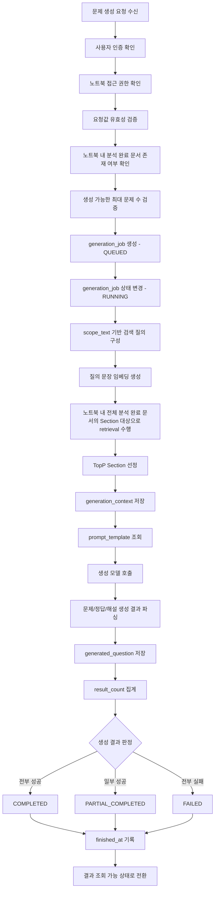
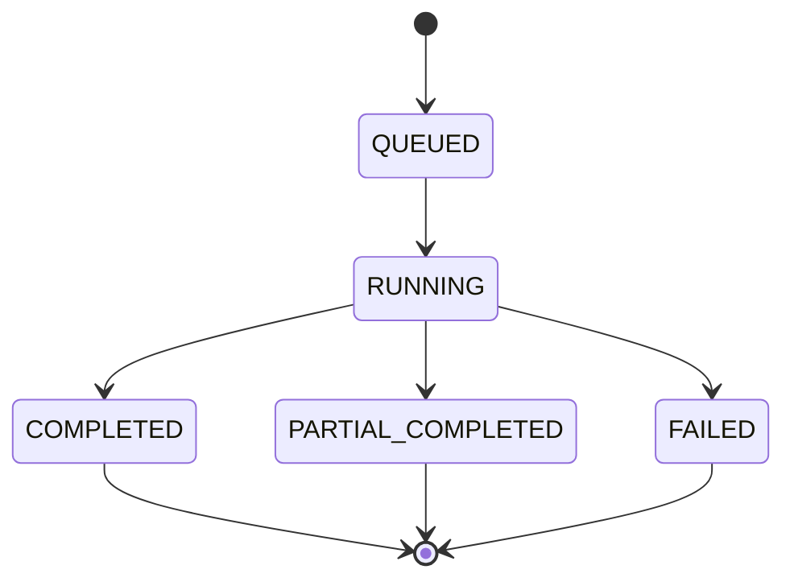
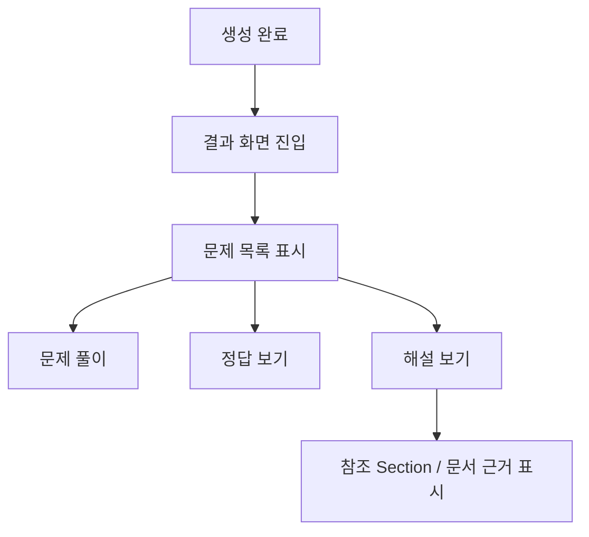

# 흐름 설계도

## 1. 문서 목적

본 문서는 SNOW 프로젝트의 핵심 기능 중 하나인 **문제 생성 기능**의 흐름을 정의한다.

문제 생성 기능은 사용자가 노트북 단위로 업로드한 여러 문서를 기반으로,  
출제 분야 또는 범위 / 문제 유형 / 난이도 / 문제 수를 입력하면  
시스템이 관련 Section을 검색한 뒤 AI 모델을 통해 문제를 생성하고 결과를 제공하는 기능이다.

본 설계서는 다음 내용을 포함한다.

- 사용자 UI 흐름
- 백엔드 처리 흐름
- 주요 상태 변화
- DB 반영 지점
- 예외 및 조건부 시나리오

---

## 2. 흐름 설계 기준

### 2.1 핵심 단위

- **노트북(notebook)**: 사용자의 학습 단위 공간
- **문서(document)**: 노트북에 업로드되는 PDF / PPT / PPTX 파일
- **Section**: 문서를 분리한 검색/생성 기준 단위
- **generation_job**: 문제 생성 요청 1건을 나타내는 단위
- **generation_context**: 문제 생성 시 참조한 retrieval 결과
- **generated_question**: 생성된 최종 문제 결과

### 2.2 기본 정책

- 사용자는 회원가입 시 기본 노트북 1개를 자동으로 부여받는다.
- 필요하면 사용자는 여러 개의 노트북을 생성할 수 있다.
- 하나의 노트북에는 문서를 최대 개수 제한 없이 업로드할 수 있다.
- 노트북 간 문서 내용은 공유되지 않는다.
- 문제 생성은 **특정 문서 1개 기준이 아니라, 해당 노트북 내 분석 완료된 전체 문서 집합**을 대상으로 수행한다.
- 문서 업로드가 끝났더라도 **분석 완료 전에는 문제 생성이 불가능하다.**
- 문제 생성 결과는 노트북 내부가 아니라 **별도 결과 화면**에서 확인한다.
- 생성 중 페이지를 이탈하더라도, 사용자는 이후 다시 결과를 조회할 수 있어야 한다.

---

## 3. 선행 흐름: 노트북 생성 및 문서 업로드/분석

문제 생성 기능은 독립적으로 실행되지 않으며, 반드시 다음 선행 흐름이 완료되어야 한다.

### 3.1 선행 흐름 다이어그램

```mermaid
flowchart TD
    A[사용자 로그인] --> B[기본 노트북 진입 또는 새 노트북 생성]
    B --> C[문서 업로드]
    C --> D[업로드 완료]
    D --> E[텍스트 추출 및 구조 분석]
    E --> F[Section 분리]
    F --> G[임베딩 생성 및 저장]
    G --> H{분석 완료 여부}
    H -- 완료 --> I[문제 생성 가능 상태]
    H -- 미완료 --> J[로딩 상태 유지 / 문제 생성 비활성화]
````

### 3.2 선행 흐름 설명 표

| 단계 | 주체     | 설명                                   | 관련 데이터/상태                |
| -- | ------ | ------------------------------------ | ------------------------ |
| 1  | UI     | 사용자가 로그인한다                           | user                     |
| 2  | UI     | 사용자가 기본 노트북에 진입하거나 새 노트북을 생성한다       | notebook                 |
| 3  | UI     | 사용자가 PDF/PPT/PPTX 문서를 업로드한다          | document                 |
| 4  | Server | 서버가 파일 저장 및 업로드 처리를 수행한다             | document                 |
| 5  | Server | 문서 텍스트를 추출한다                         | document raw text        |
| 6  | Server | 문서를 Section 단위로 분리한다                 | section                  |
| 7  | Server | 각 Section에 대한 임베딩을 생성하고 벡터 저장소에 반영한다 | vector store / section   |
| 8  | Server | 문서 분석 상태를 완료로 전환한다                   | document.analysis_status |
| 9  | UI     | 분석 완료 전까지 문제 생성 기능을 비활성화한다           | UI state                 |

---

## 4. 문제 생성 흐름

### 4.1 기능 개요

사용자가 노트북 내에서 문제 생성을 요청하면,
시스템은 해당 노트북에 속한 **분석 완료 문서 전체**를 대상으로 검색을 수행한 뒤,
검색된 Section TopP를 바탕으로 사용자가 지정한 유형과 난이도에 맞는 문제를 생성한다.

문제 생성 요청 1건은 `generation_job`으로 관리되며,
생성 완료 후 사용자는 별도 결과 화면에서 문제 풀이, 정답/해설 확인, 참조 근거 확인을 수행할 수 있다.

### 4.2 선행 조건

* 사용자는 로그인 상태여야 한다.
* 사용자는 문제를 생성할 노트북에 진입해 있어야 한다.
* 해당 노트북에는 최소 1개 이상의 문서가 업로드되어 있어야 한다.
* 해당 노트북 내에서 분석 완료된 문서가 최소 1개 이상 존재해야 한다.
* 사용자는 다음 입력값을 제공해야 한다.

    * 출제 분야 또는 범위(scope_text)
    * 문제 유형(question_type)
    * 난이도(difficulty)
    * 문제 개수(question_count)

### 4.3 UI 흐름도

```mermaid
flowchart TD
    A[사용자 로그인] --> B[노트북 진입]
    B --> C{분석 완료 문서 존재 여부}
    C -- 아니오 --> D[문서 업로드/분석 완료 대기]
    C -- 예 --> E[문제 생성 영역 진입]
    E --> F[출제 분야/범위 입력]
    F --> G[문제 유형 선택]
    G --> H[난이도 설정]
    H --> I[문제 개수 입력]
    I --> J[생성 버튼 클릭]
    J --> K[문제 생성 중입니다 화면 표시]
    K --> L{생성 완료 여부}
    L -- 완료 --> M[결과 화면 이동]
    L -- 미완료 --> K
    M --> N[문제 풀이]
    M --> O[정답/해설 확인]
    M --> P[참조 근거 Section 확인]
```

### 4.4 UI 흐름 설명 표

| 단계 | 화면     | 사용자 행동                | 시스템 반응             |
| -- | ------ | --------------------- | ------------------ |
| 1  | 로그인 화면 | 로그인 수행                | 사용자 세션 생성          |
| 2  | 노트북 화면 | 기본 노트북 진입 또는 새 노트북 생성 | 노트북 컨텍스트 로드        |
| 3  | 노트북 화면 | 업로드된 문서 확인            | 분석 상태 표시           |
| 4  | 노트북 화면 | 출제 분야/범위 입력           | 입력값 유지             |
| 5  | 노트북 화면 | 문제 유형 선택              | 객관식 / 단답형 / 서술형 선택 |
| 6  | 노트북 화면 | 난이도 설정                | 난이도 값 반영           |
| 7  | 노트북 화면 | 문제 개수 입력              | question_count 반영  |
| 8  | 노트북 화면 | 생성 버튼 클릭              | 생성 요청 전송           |
| 9  | 로딩 화면  | 대기                    | "문제 생성 중입니다." 표시   |
| 10 | 결과 화면  | 문제 풀이 / 정답 보기 / 해설 보기 | 생성 결과 조회           |
| 11 | 결과 화면  | 참조 근거 확인              | 사용된 Section 근거 표시  |

### 4.5 백엔드 흐름도



### 4.6 백엔드 흐름 설명 표

| 단계 | 처리 주체           | 설명                                                              | 관련 테이블 / 저장소                              |
| -- | --------------- | --------------------------------------------------------------- | ----------------------------------------- |
| 1  | Server          | 문제 생성 요청 수신                                                     | -                                         |
| 2  | Server          | 로그인 상태 및 사용자 인증 확인                                              | user                                      |
| 3  | Server          | 요청한 노트북 접근 권한 확인                                                | notebook                                  |
| 4  | Server          | `scope_text`, `question_type`, `difficulty`, `question_count` 검증 | generation request                        |
| 5  | Server          | 노트북 내 분석 완료 문서 존재 여부 확인                                         | document                                  |
| 6  | Server          | 생성 가능한 최대 문제 수 상한 검증                                            | source unit / section / document metadata |
| 7  | Server          | `generation_job` 생성 및 `QUEUED` 상태 저장                            | generation_job                            |
| 8  | Server          | 실제 작업 시작 시 `RUNNING` 상태로 변경                                     | generation_job                            |
| 9  | Server          | 사용자 입력 범위를 검색 질의로 구성                                            | generation_job.scope_text                 |
| 10 | Embedding Model | 검색 질의를 임베딩 벡터로 변환                                               | embedding                                 |
| 11 | Retrieval       | 노트북 내 전체 분석 완료 문서의 Section 대상으로 유사도 검색                          | section / vector store                    |
| 12 | Server          | TopP 검색 결과를 저장                                                  | generation_context                        |
| 13 | Server          | 사용 프롬프트 템플릿 조회                                                  | prompt_template                           |
| 14 | LLM             | 문제/정답/해설 생성                                                     | model response                            |
| 15 | Server          | 생성 결과를 구조화하여 저장                                                 | generated_question                        |
| 16 | Server          | 실제 생성 성공 개수 집계                                                  | generation_job.result_count               |
| 17 | Server          | 최종 상태 결정                                                        | generation_job.status                     |
| 18 | Server          | `finished_at` 기록 후 조회 가능 상태로 전환                                 | generation_job                            |

### 4.7 상태 변화 다이어그램



### 4.8 DB 반영 지점

#### 4.8.1 generation_job

문제 생성 요청 1건을 대표하는 엔티티이다.

저장/변경 시점:

* 생성 버튼 클릭 직후 `QUEUED` 상태로 생성
* 실제 생성 시작 시 `RUNNING` 변경
* 생성 결과 집계 후 `COMPLETED` / `PARTIAL_COMPLETED` / `FAILED` 중 하나로 변경
* 종료 시 `finished_at` 기록

저장 필요 항목 예시:

* job_id
* user_id
* notebook_id
* prompt_version
* scope_text
* question_type
* difficulty
* question_count
* status
* result_count
* model_name
* created_at
* finished_at

> 참고: 현재 초안 기준으로 문제 생성은 문서 1개 기준이 아니라 노트북 기준이므로,
> `generation_job.document_id` 보다는 `notebook_id` 기준 구조가 더 자연스럽다.

#### 4.8.2 generation_context

문제 생성 시 참조한 retrieval 결과를 저장한다.

저장 시점:

* TopP Section 선정 직후

저장 목적:

* 생성 근거 추적
* 결과 화면에서 참조 Section 노출
* 문제 품질 검토 및 디버깅

저장 필요 항목 예시:

* context_id
* job_id
* section_id
* rank
* similarity_score

#### 4.8.3 generated_question

생성된 최종 문제 결과를 저장한다.

저장 시점:

* 생성 모델 응답 파싱 완료 후

저장 목적:

* 결과 화면 출력
* 정답/해설 조회
* 문제 수정/검수
* 피드백 수집

저장 필요 항목 예시:

* question_id
* job_id
* type
* question_text
* choices
* answer
* explanation
* source_section_ids
* quality_score
* is_edited

### 4.9 결과 화면 흐름



### 4.10 예외 및 조건부 시나리오

#### 예외 1. 로그인하지 않은 사용자 요청

* 서버는 인증 실패를 반환한다.
* 클라이언트는 로그인 페이지로 이동시키거나 로그인 필요 메시지를 표시한다.

#### 예외 2. 노트북 접근 권한이 없는 경우

* 서버는 권한 오류를 반환한다.
* 클라이언트는 접근 불가 메시지를 표시한다.

#### 예외 3. 노트북에 업로드된 문서가 없는 경우

* 문제 생성 기능 자체를 비활성화한다.
* 사용자에게 먼저 문서를 업로드하도록 안내한다.

#### 예외 4. 문서는 존재하지만 분석이 완료되지 않은 경우

* UI에서 로딩 상태를 유지한다.
* 분석 완료 전까지 생성 버튼을 비활성화한다.
* 서버에서도 최종적으로 생성 요청을 거부한다.

#### 예외 5. 출제 분야/범위가 비어 있거나 부적절한 경우

* `scope_text`가 비어 있으면 클라이언트 또는 서버에서 검증 오류를 반환한다.
* 사용자는 출제 분야/범위를 다시 입력해야 한다.

#### 예외 6. 문제 유형 값이 허용 범위를 벗어나는 경우

* 허용 값은 `객관식`, `단답형`, `서술형`으로 제한한다.
* 허용되지 않은 값이 들어오면 요청을 거부한다.

#### 예외 7. 문제 개수가 허용 상한을 초과하는 경우

* 시스템은 노트북 내 문서 분석 결과를 바탕으로 생성 가능한 최대 문제 수를 계산한다.
* 초기 상한 기준은 SourceUnit 기반으로 설정한다.
* 상한 초과 시 생성 요청을 거부하거나 허용 범위 내로 재입력을 유도한다.

#### 예외 8. retrieval 결과가 너무 적은 경우

* 검색된 Section 수가 문제 생성에 필요한 최소 기준에 미달할 수 있다.
* 이 경우 시스템은 다음 중 하나를 수행한다.

    * 생성 요청 자체를 실패 처리
    * 가능한 범위까지만 생성 후 `PARTIAL_COMPLETED` 처리

#### 예외 9. 생성 모델 호출 실패

* 생성 모델 응답 실패, 타임아웃, 포맷 불일치가 발생할 수 있다.
* 서버는 `generation_job.status`를 `FAILED`로 전환한다.
* 필요 시 오류 로그를 별도로 기록한다.

#### 예외 10. 일부 문제만 정상 생성된 경우

* 문제 요청은 한 번에 여러 문제를 생성하는 구조이므로, 응답 품질이나 파싱 결과에 따라 일부만 유효할 수 있다.
* 유효한 문제만 저장하고 `PARTIAL_COMPLETED`로 종료한다.
* 사용자에게 일부만 생성되었음을 알려준다.

#### 예외 11. 생성 완료 전 사용자가 페이지를 이탈한 경우

* 작업은 서버에서 계속 진행된다.
* 사용자가 나중에 다시 접속하면 해당 `generation_job` 기준으로 결과를 조회할 수 있다.

#### 예외 12. DB 저장 실패

* `generated_question` 저장 또는 상태 갱신 중 오류가 발생할 수 있다.
* 시스템은 가능한 범위에서 롤백하거나 실패 상태로 전환한다.
* 로그를 남기고 재시도 또는 관리자 확인이 가능해야 한다.

### 4.11 설계 상 메모

#### 메모 1. 노트북 중심 구조 반영 필요

현재 문제 생성 흐름은 문서 1개 기준이 아니라 노트북 전체 문서 집합 기준이므로,
이후 DB 스키마 설계 시 `notebook` 축을 명확히 반영해야 한다.

#### 메모 2. scope_text 저장 필요

사용자가 입력한 출제 분야/범위 원문은 이력 조회, 디버깅, 생성 근거 추적을 위해 저장하는 것이 적절하다.

#### 메모 3. 임베딩 벡터 저장은 후속 검토 대상

초기 설계에서는 사용자 입력 원문 저장만 우선 반영하고,
질의 임베딩 벡터 자체를 RDB에 저장할지는 추후 성능/재현성/운영 관점에서 결정한다.

#### 메모 4. TopP 근거 노출을 고려한 설계 필요

결과 화면에서 참조 근거를 노출할 예정이므로,
`generation_context`와 `generated_question` 간의 연결 관계는 추후 DB 설계 시 더 정교하게 다듬을 필요가 있다.

---

## 5. 후속 설계 연결 포인트

본 흐름 설계서는 이후 다음 산출물과 직접 연결된다.

1. **DB 스키마 수정**

    * notebook 도입
    * generation_job의 기준 축 변경 검토
    * scope_text 반영
    * generation_context / generated_question 정교화

2. **API 설계**

    * 문제 생성 요청 API
    * 생성 상태 조회 API
    * 생성 결과 조회 API
    * 참조 근거 조회 API

3. **화면 설계**

    * 노트북 화면
    * 생성 중 로딩 화면
    * 문제 결과 화면
    * 정답/해설 및 근거 표시 UI

