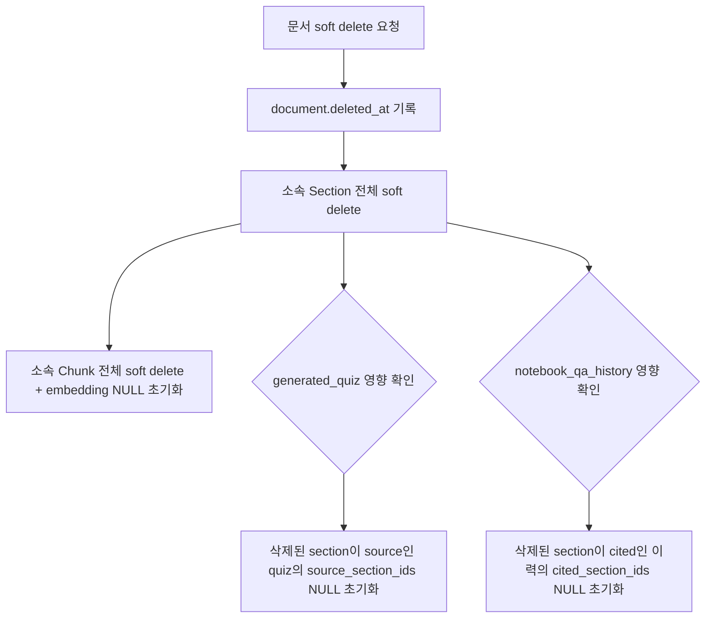
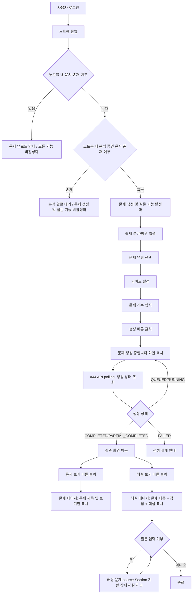
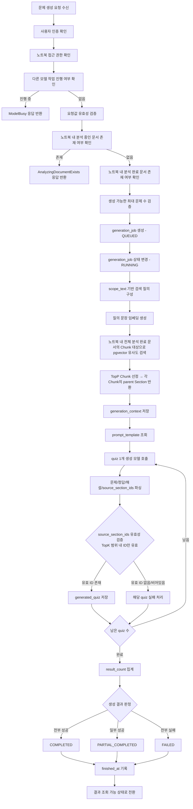
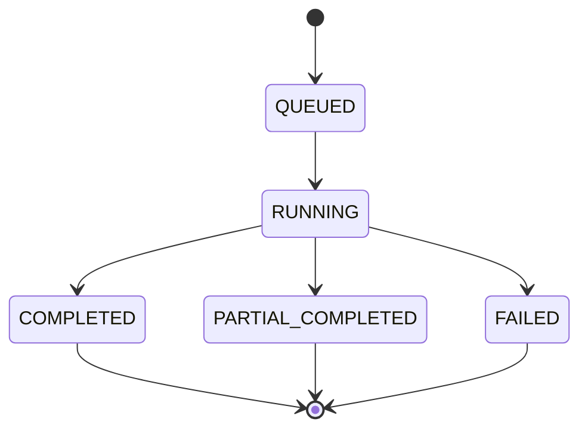
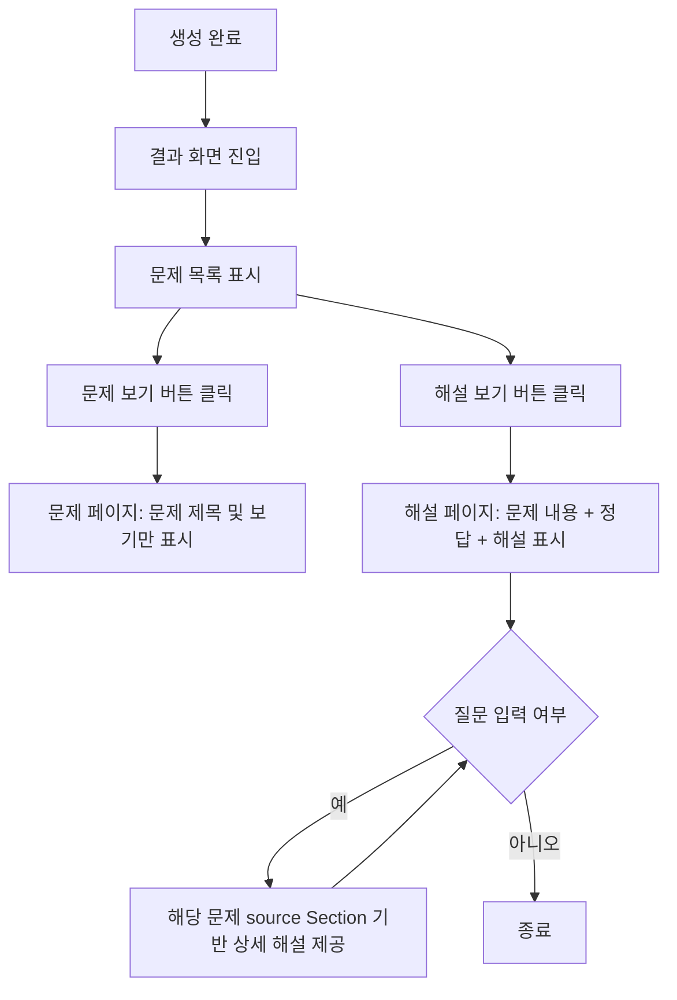
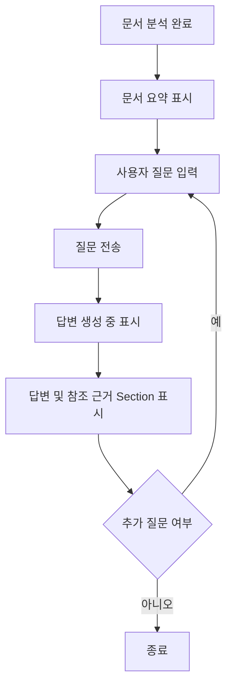
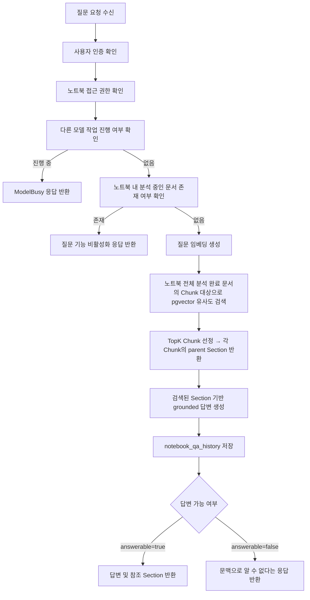
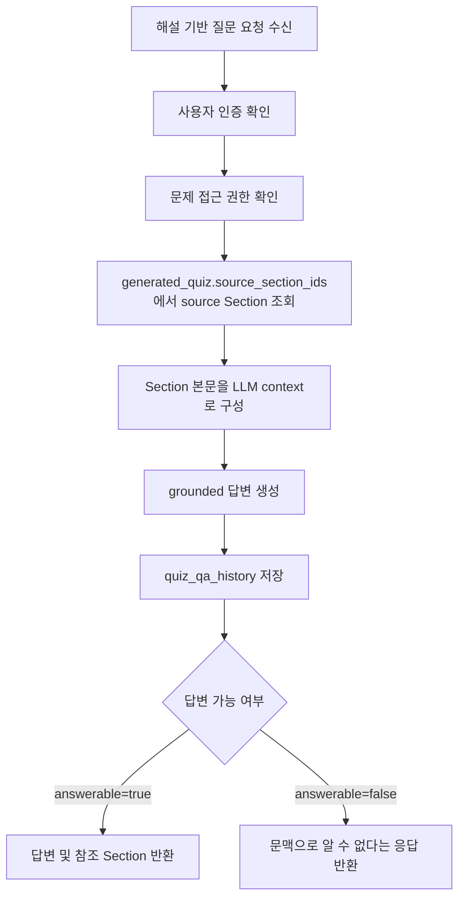

# 흐름 설계도

## 1. 문서 목적

본 문서는 SNOW 프로젝트의 핵심 기능 중 하나인 **문제 생성 기능**의 흐름을 정의한다.

문제 생성 기능은 사용자가 노트북 단위로 업로드한 여러 문서를 기반으로,  
출제 분야 또는 범위 / 문제 유형 / 난이도 / 문제 수를 입력하면  
시스템이 관련 Section을 검색한 뒤 AI 모델을 통해 문제를 생성하고 결과를 제공하는 기능이다.

본 설계서는 다음 내용을 포함한다.

- 사용자 UI 흐름
- 백엔드 처리 흐름
- 주요 상태 변화
- DB 반영 지점
- 예외 및 조건부 시나리오

---

## 2. 흐름 설계 기준

### 2.1 핵심 단위

- **노트북(notebook)**: 사용자의 학습 단위 공간
- **문서(document)**: 노트북에 업로드되는 PDF / PPT / PPTX 파일
- **Section**: 문서를 의미 단위로 분리한 덩어리. LLM context로 사용된다.
- **Chunk**: Section을 더 잘게 분리한 검색 단위. pgvector 임베딩 대상이며 벡터 유사도 검색에 사용된다.
- **generation_job**: 문제 생성 요청 1건을 나타내는 단위
- **generation_context**: 문제 생성 시 참조한 retrieval 결과 (parent Section 기준으로 저장, 내부 추적/디버깅용)
- **generated_quiz**: 생성된 최종 문제 결과

### 2.2 기본 정책

- 사용자는 회원가입 시 기본 노트북 1개를 자동으로 부여받는다.
- 필요하면 사용자는 여러 개의 노트북을 생성할 수 있다.
- 하나의 노트북에는 문서를 최대 개수 제한 없이 업로드할 수 있다.
- 노트북 간 문서 내용은 공유되지 않는다.
- 문제 생성은 **특정 문서 1개 기준이 아니라, 해당 노트북 내 분석 완료된 전체 문서 집합**을 대상으로 수행한다.
- 문서 업로드가 끝났더라도 **분석 완료 전에는 문제 생성이 불가능하다.**
- 노트북 내 분석 중(`ANALYZING`)인 문서가 1개라도 있으면 **질문 및 문제 생성은 전면 비활성화된다.**
- 단, 분석 중 여부와 무관하게 **이미 생성된 문제 및 해설에 대한 조회는 항상 가능하다.**
- **ModelBusy**: 노트북 Q&A 답변 생성 또는 문제 생성이 진행 중이면 새 문서 업로드, 질문 입력, 문제 생성 요청이 차단된다. 문서 분석 파이프라인 내 요약 생성(#22)은 ModelBusy 조건에 해당하지 않는다 (ANALYZING 상태로 이미 제어됨).
- 해설 기반 질문은 source Section이 고정되어 있어 ModelBusy 조건과 무관하게 항상 가능하다.
- 문서 삭제는 soft delete로 처리하며, 삭제 시점에 해당 문서에서 비롯된 산출물에 cascade 정책을 적용한다 (3.4 문서 삭제 cascade 정책 참고).
- 문제 생성 결과는 노트북 내부가 아니라 **별도 결과 화면**에서 확인한다.
- 생성 중 페이지를 이탈하더라도, 사용자는 이후 다시 결과를 조회할 수 있어야 한다.
- **문제는 quiz 1개씩 개별 LLM 호출로 생성한다.** 배치 호출은 소형 모델의 응답 포맷 준수율 저하 위험이 있어 사용하지 않는다.
- **TopK ≥ quiz_count를 기본 정책으로 한다.** retrieval 단계에서 quiz_count 이상의 Section을 확보해 중복 문제 생성 가능성을 줄인다.

---

## 3. 선행 흐름: 노트북 생성 및 문서 업로드/분석

문제 생성 기능은 독립적으로 실행되지 않으며, 반드시 다음 선행 흐름이 완료되어야 한다.

### 3.1 선행 흐름 다이어그램

```mermaid
flowchart TD
    A[사용자 로그인] --> B[기본 노트북 진입 또는 새 노트북 생성]
    B --> C[문서 업로드]
    C --> D[업로드 API 즉각 응답: document_id + ANALYZING]
    D --> E[백그라운드: 텍스트 추출 및 구조 분석]
    E --> F[Section 분리 및 DB 저장]
    F --> F2[Section → Chunk 분리 및 DB 저장]
    F2 --> G[Chunk 임베딩 생성 및 pgvector 저장]
    G --> G2[문서 요약 생성 및 저장]
    G2 --> G3{파이프라인 성공 여부}
    G3 -- 성공 --> G4[분석 상태 COMPLETED 전환]
    G3 -- 실패 --> G5[분석 상태 FAILED 전환 / soft delete 처리]
    D --> P[프론트: 분석 상태 polling 시작]
    P --> H{분석 상태}
    H -- ANALYZING --> P
    H -- COMPLETED --> I[요약 표시 / 문제 생성 및 질문 기능 활성화]
    H -- FAILED --> J[업로드 오류 안내 / 문서 취소 처리]
````

### 3.2 선행 흐름 설명 표

| 단계 | 주체     | 설명                                   | 관련 데이터/상태                |
| -- | ------ | ------------------------------------ | ------------------------ |
| 1  | UI     | 사용자가 로그인한다                           | user                     |
| 2  | UI     | 사용자가 기본 노트북에 진입하거나 새 노트북을 생성한다       | notebook                 |
| 3  | UI     | 사용자가 PDF/PPT/PPTX 문서를 업로드한다          | document                 |
| 4  | Server | 서버가 파일을 저장하고 `document_id`와 `ANALYZING` 상태를 즉각 반환한다. 이후 분석 파이프라인은 비동기로 진행된다. | document (ANALYZING)     |
| 5  | UI     | 프론트가 분석 상태 polling을 시작한다 (#13 API 주기적 호출) | document.analysis_status |
| 6  | Server | 문서 텍스트를 추출한다 (비동기)                   | document raw text        |
| 7  | Server | 문서를 Section 단위로 분리하고 DB에 저장한다 (비동기). Section은 LLM context 단위다 | section                  |
| 8  | Server | 각 Section을 Chunk 단위로 더 잘게 분리하고 DB에 저장한다 (비동기). Chunk는 벡터 검색 단위다 | chunk                    |
| 9  | Server | 각 Chunk에 대한 임베딩을 생성하고 pgvector에 저장한다 (비동기). 검색 시 Chunk를 찾고 parent Section을 반환한다 | chunk.embedding (pgvector) |
| 10 | Server | 문서 전체 텍스트를 기반으로 AI 모델을 통해 요약을 생성한다 (비동기) | document summary         |
| 11 | Server | 생성된 요약을 문서에 저장한다 (비동기)               | document.summary         |
| 12 | Server | 파이프라인 성공 시 분석 상태를 COMPLETED로, 실패 시 FAILED로 전환한다. FAILED 시 해당 문서를 soft delete 처리한다 (비동기) | document.analysis_status |
| 13 | UI     | polling 결과가 COMPLETED이면 요약을 표시하고 문제 생성 및 질문 기능을 활성화한다 | UI state                 |
| 14 | UI     | polling 결과가 FAILED이면 업로드 오류를 안내하고 해당 문서를 취소 처리한다 | UI state                 |

### 3.3 문서 분석 상태 전환 다이어그램

```mermaid
stateDiagram-v2
    [*] --> UPLOADED
    UPLOADED --> ANALYZING
    ANALYZING --> COMPLETED
    ANALYZING --> FAILED
    COMPLETED --> [*]
    FAILED --> [*]
```

- `UPLOADED`: 파일 저장 완료, 분석 파이프라인 시작 전
- `ANALYZING`: 텍스트 추출 → 청킹 → 임베딩 → 요약 파이프라인 진행 중
- `COMPLETED`: 파이프라인 전체 완료, 사용자에게 요약 제공 및 기능 활성화
- `FAILED`: 파이프라인 중 오류 발생, soft delete 처리되어 사용자에게 노출되지 않음

---

### 3.4 문서 삭제 cascade 정책

사용자가 문서 삭제를 요청하면 soft delete로 처리하며, 해당 문서에서 비롯된 산출물에 아래 cascade 정책을 삭제 시점에 일괄 적용한다.



| 산출물 | cascade 정책 | 기준 |
|--------|------------|------|
| section | cascade soft delete | 해당 document 소속 전체 |
| chunk | cascade soft delete + embedding NULL 초기화 | 삭제된 section 소속 전체 |
| generated_quiz | source_section_ids NULL 초기화 | 삭제된 section이 source인 quiz만 |
| quiz_qa_history | cascade 제외 | quiz 유지이므로 그대로 보존 |
| notebook_qa_history | cited_section_ids NULL 초기화 | 삭제된 section이 cited인 이력만 |
| generation_context | cascade 제외 | 내부 추적/디버깅용, 사용자 노출 없음 |

> 노트북 삭제(#8) 시에도 동일 cascade 정책이 노트북 소속 모든 document에 순차 적용된다.

---

## 4. 문제 생성 흐름

### 4.1 기능 개요

사용자가 노트북 내에서 문제 생성을 요청하면,
시스템은 해당 노트북에 속한 **분석 완료 문서 전체**를 대상으로 검색을 수행한 뒤,
검색된 Section TopK를 바탕으로 사용자가 지정한 유형과 난이도에 맞는 문제를 생성한다.

문제 생성 요청 1건은 `generation_job`으로 관리되며,
생성 완료 후 사용자는 별도 결과 화면에서 문제 풀이, 정답/해설 확인, 참조 근거 확인을 수행할 수 있다.

### 4.2 선행 조건

* 사용자는 로그인 상태여야 한다.
* 사용자는 문제를 생성할 노트북에 진입해 있어야 한다.
* 해당 노트북에는 최소 1개 이상의 문서가 업로드되어 있어야 한다.
* 해당 노트북 내 모든 문서가 분석 완료(`COMPLETED`) 상태여야 한다. 분석 중(`ANALYZING`)인 문서가 1개라도 있으면 비활성화된다.
* 사용자는 다음 입력값을 제공해야 한다.

    * 출제 분야 또는 범위(scope_text)
    * 문제 유형(quiz_type)
    * 난이도(difficulty)
    * 문제 개수(quiz_count)

### 4.3 UI 흐름도



### 4.4 UI 흐름 설명 표

| 단계 | 화면     | 사용자 행동                | 시스템 반응             |
| -- | ------ | --------------------- | ------------------ |
| 1  | 로그인 화면 | 로그인 수행                | 사용자 세션 생성          |
| 2  | 노트북 화면 | 기본 노트북 진입 또는 새 노트북 생성 | 노트북 컨텍스트 로드        |
| 3  | 노트북 화면 | 업로드된 문서 확인            | 분석 상태 표시           |
| 4  | 노트북 화면 | 출제 분야/범위 입력           | 입력값 유지             |
| 5  | 노트북 화면 | 문제 유형 선택              | 객관식 / 단답형 / 서술형 선택 |
| 6  | 노트북 화면 | 난이도 설정                | 난이도 값 반영           |
| 7  | 노트북 화면 | 문제 개수 입력              | quiz_count 반영  |
| 8  | 노트북 화면 | 생성 버튼 클릭              | 생성 요청 전송           |
| 9  | 로딩 화면  | 대기                    | "문제 생성 중입니다." 표시 / #44 API polling으로 생성 상태 주기적 확인 |
| 10 | 결과 화면  | 문제 보기 버튼 클릭           | 문제 페이지로 이동 (문제 제목 및 보기만 표시)   |
| 11 | 결과 화면  | 해설 보기 버튼 클릭           | 해설 페이지로 이동 (해설 및 정답만 표시)      |
| 12 | 해설 페이지 | 질문 입력                 | 해당 문제 source Section 기반 상세 해설 반환 |

### 4.5 백엔드 흐름도



### 4.6 백엔드 흐름 설명 표

| 단계 | 처리 주체           | 설명                                                              | 관련 테이블 / 저장소                              |
| -- | --------------- | --------------------------------------------------------------- | ----------------------------------------- |
| 1  | Server          | 문제 생성 요청 수신                                                     | -                                         |
| 2  | Server          | 로그인 상태 및 사용자 인증 확인                                              | user                                      |
| 3  | Server          | 요청한 노트북 접근 권한 확인                                                | notebook                                  |
| 4  | Server          | 다른 모델 작업(노트북 Q&A 답변 생성 또는 문제 생성) 진행 여부 확인. 진행 중이면 ModelBusy 반환 | -                                         |
| 5  | Server          | `scope_text`, `quiz_type`, `difficulty`, `quiz_count` 검증 | generation request                        |
| 6  | Server          | 노트북 내 분석 중인 문서 존재 여부 확인. 존재 시 AnalyzingDocumentExists 반환        | document                                  |
| 7  | Server          | 노트북 내 분석 완료 문서 존재 여부 확인                                         | document                                  |
| 8  | Server          | 생성 가능한 최대 문제 수 상한 검증                                            | source unit / section / document metadata |
| 9  | Server          | `generation_job` 생성 및 `QUEUED` 상태 저장                            | generation_job                            |
| 10 | Server          | 실제 작업 시작 시 `RUNNING` 상태로 변경                                     | generation_job                            |
| 11 | Server          | 사용자 입력 범위를 검색 질의로 구성                                            | generation_job.scope_text                 |
| 12 | Embedding Model | 검색 질의를 임베딩 벡터로 변환                                               | embedding                                 |
| 13 | Retrieval       | 노트북 내 전체 분석 완료 문서의 Chunk 대상으로 pgvector 유사도 검색. 각 Chunk의 parent Section을 반환한다 (Parent-Child Retrieval). TopK ≥ quiz_count 보장 | chunk, section                            |
| 14 | Server          | TopK 검색 결과를 저장                                                  | generation_context                        |
| 15 | Server          | 사용 프롬프트 템플릿 조회                                                  | prompt_template                           |
| 16 | LLM             | quiz 1개씩 개별 호출 (quiz_count번 반복). 각 호출마다 TopK Section 전체를 context로 제공. 응답 포맷에 source_section_ids 포함 | model response                            |
| 17 | Server          | 파싱 → source_section_ids 유효성 검증 (TopK 범위 외 ID 제거, 빈 경우 해당 quiz 실패) → 유효한 quiz 저장. quiz_count번 반복 | generated_quiz                            |
| 18 | Server          | 실제 저장 성공한 quiz 수 집계                                              | generation_job.result_count               |
| 19 | Server          | 최종 상태 결정                                                        | generation_job.status                     |
| 20 | Server          | `finished_at` 기록 후 조회 가능 상태로 전환                                 | generation_job                            |

### 4.7 상태 변화 다이어그램



### 4.8 DB 반영 지점

#### 4.8.1 generation_job

문제 생성 요청 1건을 대표하는 엔티티이다.

저장/변경 시점:

* 생성 버튼 클릭 직후 `QUEUED` 상태로 생성
* 실제 생성 시작 시 `RUNNING` 변경
* 생성 결과 집계 후 `COMPLETED` / `PARTIAL_COMPLETED` / `FAILED` 중 하나로 변경
* 종료 시 `finished_at` 기록

저장 필요 항목 예시:

* job_id
* user_id
* notebook_id
* prompt_version
* scope_text
* quiz_type
* difficulty
* question_count
* status
* result_count
* model_name
* created_at
* finished_at


#### 4.8.2 generation_context

문제 생성 시 참조한 retrieval 결과를 저장한다.

저장 시점:

* TopP Section 선정 직후

저장 목적:

* 생성 근거 추적 (내부 추적/디버깅 전용, 사용자에게 직접 노출하지 않음)
* 문제 품질 검토
* source_section_ids 유효성 검증 기준 (LLM이 인용한 ID가 TopK 범위 내인지 확인)

저장 필요 항목 예시:

* context_id
* job_id
* section_id
* rank
* similarity_score

#### 4.8.3 generated_quiz

생성된 최종 문제 결과를 저장한다.

저장 시점:

* 생성 모델 응답 파싱 완료 후

저장 목적:

* 결과 화면 출력
* 정답/해설 조회
* 문제 수정/검수
* 피드백 수집

저장 필요 항목 예시:

* quiz_id
* job_id
* type
* question_text
* choices
* answer
* explanation
* source_section_ids (LLM이 인용한 section_id 목록 — TopK 범위 내 유효 ID만 저장)
* quality_score
* is_edited

### 4.9 결과 화면 흐름



### 4.10 예외 및 조건부 시나리오

#### 예외 1. 로그인하지 않은 사용자 요청

* 서버는 인증 실패를 반환한다.
* 클라이언트는 로그인 페이지로 이동시키거나 로그인 필요 메시지를 표시한다.

#### 예외 2. 노트북 접근 권한이 없는 경우

* 서버는 권한 오류를 반환한다.
* 클라이언트는 접근 불가 메시지를 표시한다.

#### 예외 3. 노트북에 업로드된 문서가 없는 경우

* 문제 생성 기능 자체를 비활성화한다.
* 사용자에게 먼저 문서를 업로드하도록 안내한다.

#### 예외 4. 노트북 내 분석 중인 문서가 존재하는 경우

* 분석 완료된 문서가 일부 있더라도, 분석 중(`ANALYZING`)인 문서가 1개라도 있으면 질문 및 문제 생성을 전면 비활성화한다.
* UI에서는 분석 진행 상태를 표시하고 모든 문서 분석 완료를 대기하도록 안내한다.
* 서버에서도 최종적으로 생성 요청을 거부한다.
* 단, 이미 생성된 문제 및 해설에 대한 조회는 이 조건과 무관하게 허용된다.

#### 예외 5. 출제 분야/범위가 비어 있거나 부적절한 경우

* `scope_text`가 비어 있으면 클라이언트 또는 서버에서 검증 오류를 반환한다.
* 사용자는 출제 분야/범위를 다시 입력해야 한다.

#### 예외 6. 문제 유형 값이 허용 범위를 벗어나는 경우

* 허용 값은 `객관식`, `단답형`, `서술형`으로 제한한다.
* 허용되지 않은 값이 들어오면 요청을 거부한다.

#### 예외 7. 문제 개수가 허용 상한을 초과하는 경우

* 시스템은 노트북 내 문서 분석 결과를 바탕으로 생성 가능한 최대 문제 수를 계산한다.
* 상한 기준은 노트북 내 분석 완료 문서의 전체 Section 수로 설정한다 (function-specs #32).
* 상한 초과 시 생성 요청을 거부하거나 허용 범위 내로 재입력을 유도한다.

#### 예외 8. retrieval 결과가 너무 적은 경우

* 검색된 Section 수가 문제 생성에 필요한 최소 기준에 미달할 수 있다.
* 이 경우 시스템은 다음 중 하나를 수행한다.

    * 생성 요청 자체를 실패 처리
    * 가능한 범위까지만 생성 후 `PARTIAL_COMPLETED` 처리

#### 예외 9. 생성 모델 호출 실패

* 생성 모델 응답 실패, 타임아웃, 포맷 불일치가 발생할 수 있다.
* 서버는 `generation_job.status`를 `FAILED`로 전환한다.
* 필요 시 오류 로그를 별도로 기록한다.

#### 예외 10. 일부 문제만 정상 생성된 경우

* 문제 요청은 한 번에 여러 문제를 생성하는 구조이므로, 응답 품질이나 파싱 결과에 따라 일부만 유효할 수 있다.
* 개별 quiz가 실패로 처리되는 조건: 파싱 실패(응답 포맷 불일치), source_section_ids 유효 ID 없음.
* 유효한 quiz만 저장하고 `PARTIAL_COMPLETED`로 종료한다.
* 사용자에게 일부만 생성되었음을 알려준다.

#### 예외 11. 생성 완료 전 사용자가 페이지를 이탈한 경우

* 작업은 서버에서 계속 진행된다.
* 사용자가 나중에 다시 접속하면 해당 `generation_job` 기준으로 결과를 조회할 수 있다.

#### 예외 12. DB 저장 실패

* `generated_quiz` 저장 또는 상태 갱신 중 오류가 발생할 수 있다.
* 시스템은 가능한 범위에서 롤백하거나 실패 상태로 전환한다.
* 로그를 남기고 재시도 또는 관리자 확인이 가능해야 한다.

### 4.11 설계 상 메모

#### 메모 1. 임베딩 벡터 저장은 후속 검토 대상

초기 설계에서는 사용자 입력 원문 저장만 우선 반영하고,
질의 임베딩 벡터 자체를 RDB에 저장할지는 추후 성능/재현성/운영 관점에서 결정한다.

#### 메모 2. 프롬프트 구성 시 section_id 명시 필요

LLM이 source_section_ids를 응답에 포함하려면 프롬프트에 각 Section의 content와 함께 section_id를 명시해야 한다. 응답 포맷(JSON 스키마 등)도 source_section_ids 필드를 포함해 정의하고, 파싱 후 TopK 범위 외 ID는 제거하며 유효 ID가 없는 quiz는 실패 처리한다.

#### 메모 3. 개별 LLM 호출 및 TopK 정책 근거

문제 생성은 quiz 1개씩 개별 LLM 호출로 처리한다. 소형 모델(qwen3:4b)은 N개 quiz를 한 번에 생성하는 배치 응답에서 포맷 준수율이 낮아지므로, 응답이 짧은 개별 호출이 품질과 fault isolation 측면에서 더 유리하다. 중복 문제 방지를 위해 TopK ≥ quiz_count를 기본 정책으로 적용하며, Section 기반 의미 단위 청킹 덕분에 TopK Section들은 이미 의미적으로 충분히 구분된다. 이전 생성 문제를 프롬프트에 포함하지 않아도 중복 가능성이 낮다.

---

## 5. 질문 답변 흐름

### 5.1 기능 개요

사용자가 문서 요약을 확인한 후 궁금한 내용을 질문하면,
시스템은 노트북 내 분석 완료된 전체 문서의 Section을 대상으로 retrieval을 수행하고,
검색된 Section을 근거로 답변과 참조 근거를 반환한다.

요약은 단일 문서 기준으로 제공되지만, 질문은 노트북 내 전체 문서를 대상으로 동작한다.

### 5.2 선행 조건

- 사용자는 로그인 상태여야 한다.
- 사용자는 질문할 노트북에 진입해 있어야 한다.
- 노트북 내 문서가 1개 이상 존재해야 한다.
- 노트북 내 모든 문서가 분석 완료(`COMPLETED`) 상태여야 한다.
- 분석 중(`ANALYZING`)인 문서가 1개라도 있으면 질문 기능이 비활성화된다.
- 현재 다른 모델 작업(요약 질문 답변 생성, 문제 생성)이 진행 중이지 않아야 한다.

### 5.3 UI 흐름도



### 5.4 백엔드 흐름도



### 5.5 예외 및 조건부 시나리오

#### 예외 1. 분석 중인 문서가 존재하는 경우

- 질문 기능을 비활성화하고 모든 문서 분석 완료 대기를 안내한다.
- 서버에서도 요청을 거부한다.

#### 예외 2. 다른 모델 작업이 진행 중인 경우

- 요약 질문 답변 생성 또는 문제 생성이 진행 중이면 질문 요청을 거부한다.
- 클라이언트는 진행 중인 작업이 완료될 때까지 질문 기능을 비활성화한다.

#### 예외 3. 질문이 비어 있는 경우

- 클라이언트 또는 서버에서 검증 오류를 반환한다.

#### 예외 4. retrieval 결과가 없거나 부족한 경우

- `answerable=false`로 응답하고 관련 내용을 찾을 수 없다는 안내를 반환한다.

#### 예외 5. 생성 모델 호출 실패

- 답변 생성 실패 오류를 반환한다.

---

## 6. 해설 기반 질문 흐름

### 6.1 기능 개요

사용자가 해설 페이지에서 특정 문제에 대한 질문을 입력하면,
시스템은 `generated_quiz.source_section_ids`에 저장된 source Section들을 직접 LLM context로 구성하여 답변을 생성한다.

pgvector 검색을 수행하지 않는다. `generated_quiz`에 저장된 source Section 목록만 검색 범위로 사용한다.
해설 기반 질문은 다른 모델 작업(요약 질문 답변 생성, 문제 생성)과 독립적으로 진행 가능하다.

### 6.2 선행 조건

- 사용자는 로그인 상태여야 한다.
- 해당 `generated_quiz`가 존재해야 한다.
- 사용자는 해당 문제의 소유자여야 한다.

### 6.3 백엔드 흐름도



### 6.4 예외 및 조건부 시나리오

#### 예외 1. 로그인하지 않은 사용자 요청

- 서버는 인증 실패를 반환한다.

#### 예외 2. 문제 접근 권한이 없는 경우

- 서버는 권한 오류를 반환한다.

#### 예외 3. 질문이 비어 있는 경우

- 클라이언트 또는 서버에서 검증 오류를 반환한다.

#### 예외 4. source Section이 없는 경우

- `generated_quiz.source_section_ids`가 NULL이면 (원본 document 삭제로 source 소실) 답변 생성 불가로 응답한다.

#### 예외 5. 생성 모델 호출 실패

- 답변 생성 실패 오류를 반환한다.

---

## 7. 후속 설계 연결 포인트

본 흐름 설계서는 이후 다음 산출물과 직접 연결된다.

1. **DB 스키마 수정**

    * notebook 도입
    * generation_job의 기준 축 변경 검토
    * scope_text 반영
    * generation_context / generated_quiz 정교화

2. **API 설계**

    * 문제 생성 요청 API
    * 생성 상태 조회 API
    * 생성 결과 조회 API
    * 참조 근거 조회 API

3. **화면 설계**

    * 노트북 화면
    * 생성 중 로딩 화면
    * 문제 결과 화면
    * 정답/해설 및 근거 표시 UI

